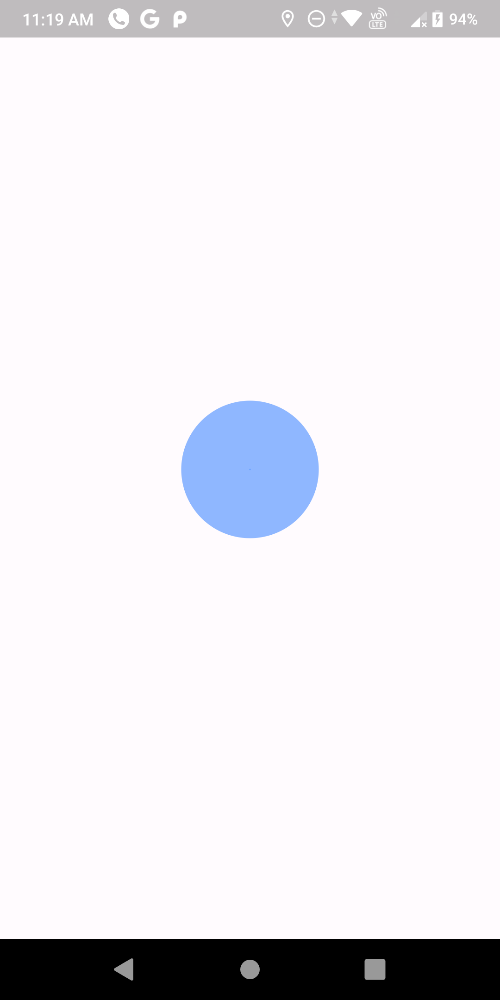
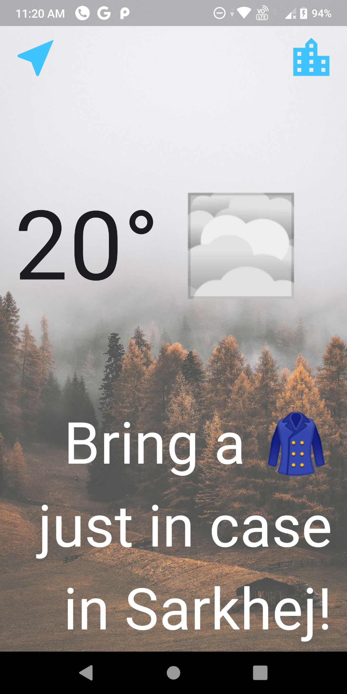
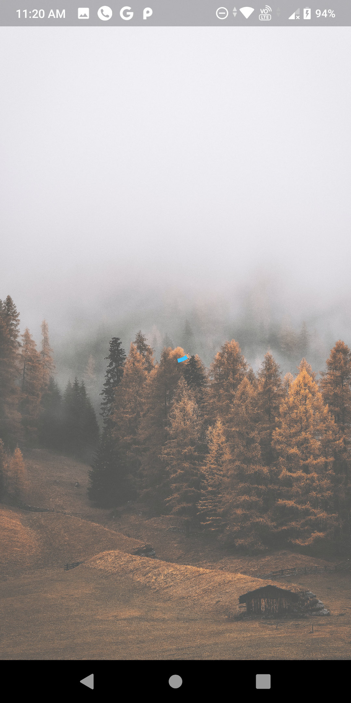
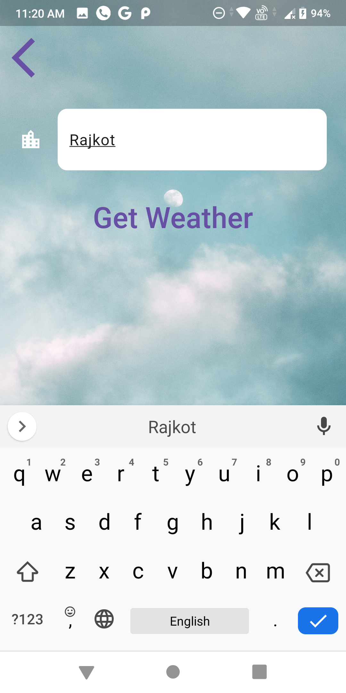
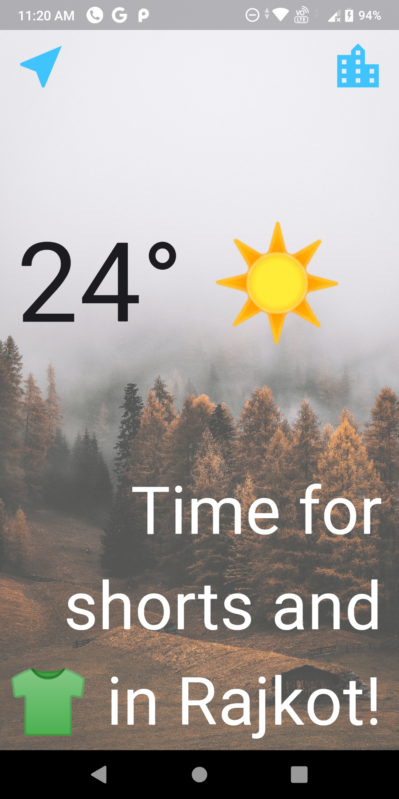

# Weather Application

This project is built using BLoC State-Management tool and OpenWeather API.

In this project MVC architecture is being followed.

Add your API key wherever required

## Demo

&nbsp;&nbsp; &nbsp;&nbsp;&nbsp;&nbsp;&nbsp;&nbsp;&nbsp;&nbsp;